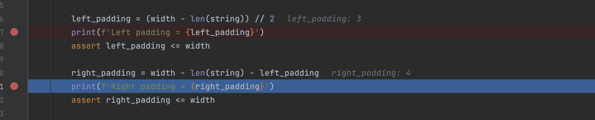
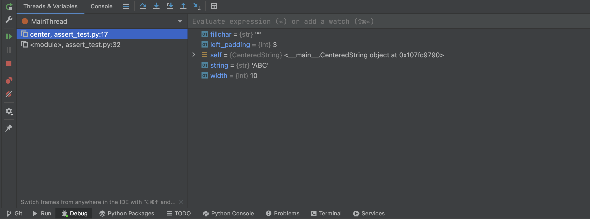
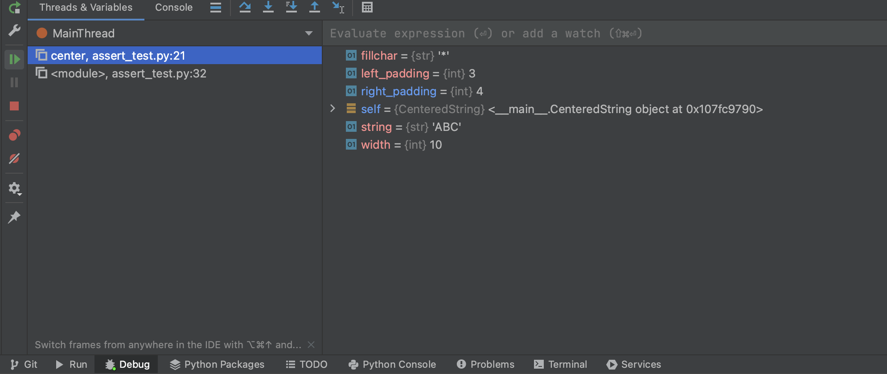
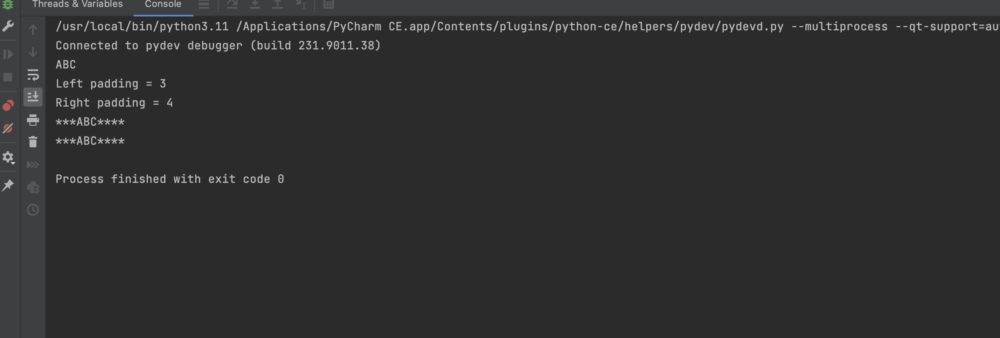

<h1 align="center">Процесс отладки кода в интегрированной среде разработки PyCharm</h1>

<h3> Добавим в программу две точки остановки</h3>
</img>

<h3>Скриншот вывода первой точки остановки во время отладки</h3>
</img>

<h3>Скриншот вывода второй точки остановки во время отладки</h3>
</img>

<h3>Вывод результата отладки</h3>
</img>

