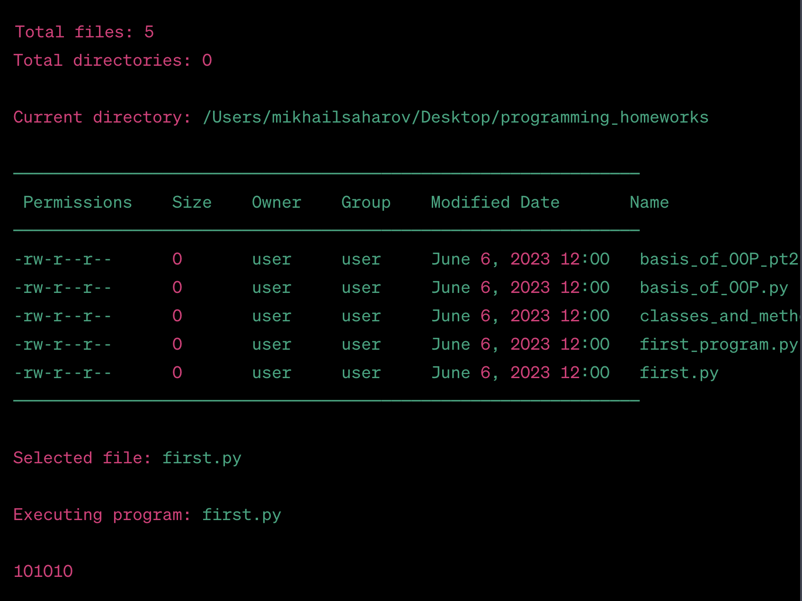

<h1>Лекция № 7. Файловый менеджер Far</h1>

В данной лекции представлены материалы для изучения и дальнейшей работы
с файловым менеджером Far.

Отмечу, что использую ноутбук на базе операционной системы Mac Os, поэтому отыскал альтернативу
в виде файлового менеджера Midnight Commander.

<h4>Скриншот работы программы с использованием Midnight Commander</h4>
</img>

Таким образом в ходе лекции получено представление о файловых менеджерах
Far и Midnight Commander, второй удалось использовать на практике.

