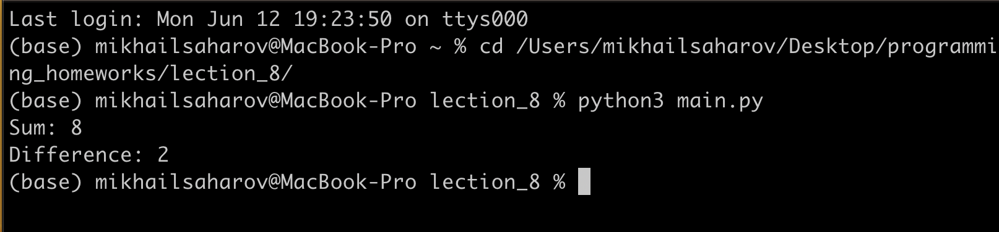

<h1>Тестирование программы в консоли Linux</h1>

<h3>Скриншот с выводом программы в консоли Linux</h3>
</img>

На данном скриншоте представлен вывод программы из Лекции № 8

Отмечу: вывод идентичен тому, что представлен в файле

<h3>Рефлексия по Лекции № 10 "Linux (промежуточное - 2)"</h3>

<ol>
<li>Повторил "Основы командной строки через курсы Хекслета</li>
<li>Проверил: установлен ли корректно на моем ноутбуке файловый менеджер Midnight Commander</li>
<li>Закрепил навыки работы с консолью через переход к файлу с модулем и вывел результат работы программы на экран</li>
<li>В финале подготовлен файл .md с домашним заданием</li>
</ol>
